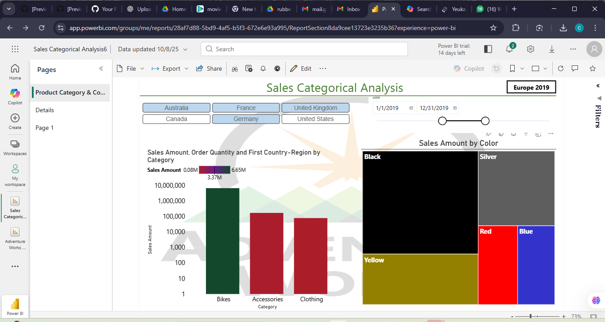

Sales Categorical Analysis Dashboard

This project features an interactive Power BI dashboard that analyzes sales performance across product categories, colors, regions, and time.
The dashboard was created as part of the Microsoft Power BI Professional Certificate coursework.

🖼️ Preview

📊 Dashboard Insights

This Power BI report helps users explore:
Sales Amount by Category (Bikes, Accessories, Clothing)
Order Quantity across Countries (Australia, France, UK, US, Germany, etc.)
Sales Amount by Color using a treemap visualization
Date-range filtering using a dynamic timeline slicer
Region-based filtering for comparative analysis

🧰 Tools Used

Microsoft Power BI
Power Query (ETL)
Visualization tools

📁 Files Included

Sales_Categorical_Analysis.pbix — Power BI project file
Sales_Categorical_Analysis.png — Dashboard screenshot

✨ Project Description

The Sales Categorical Analysis Dashboard provides a high-level overview of how sales vary based on product category, color attributes, and geographical regions.
It combines bar charts, treemaps, slicers, and date filters to allow business users to interactively explore trends and support decision-making.
